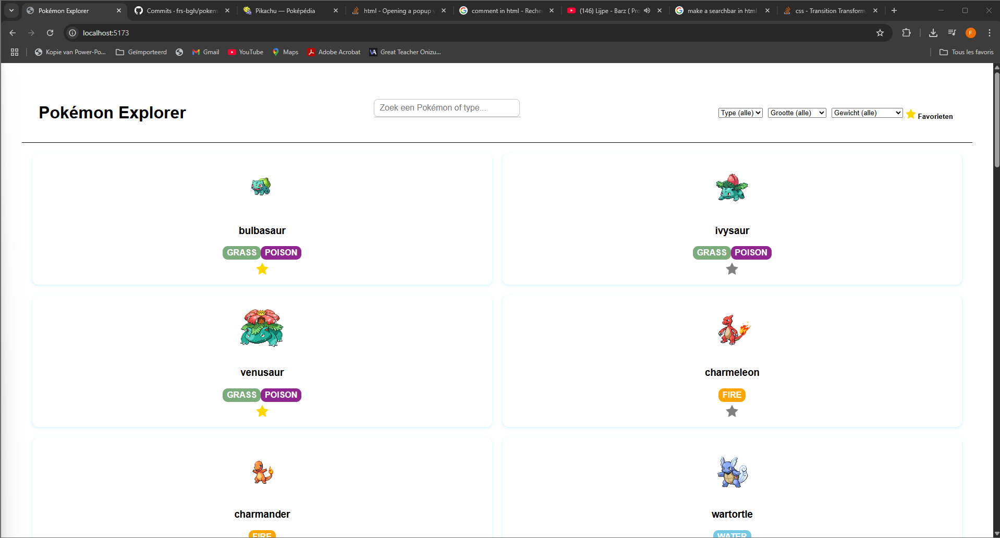
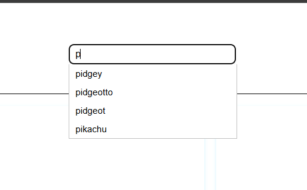
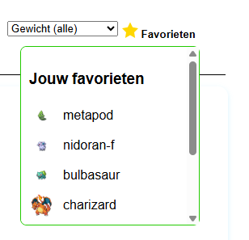
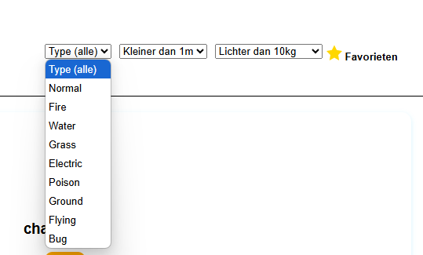
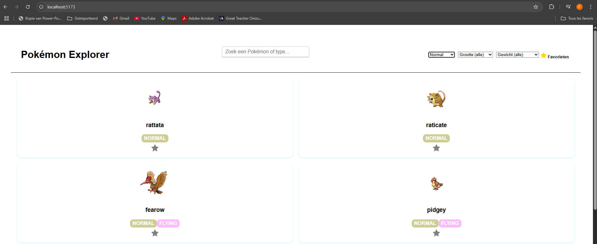
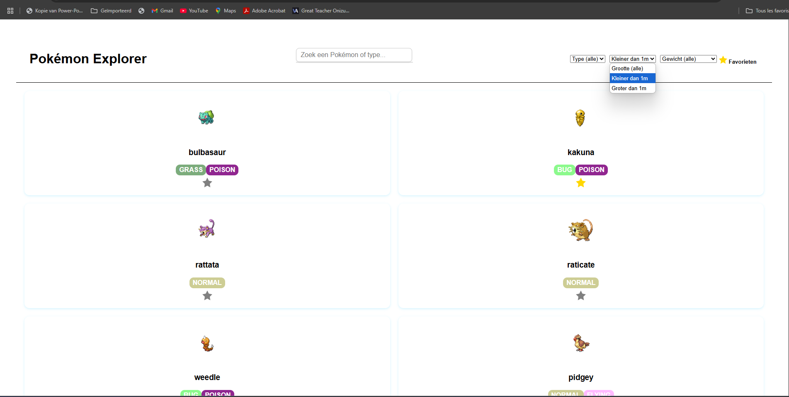
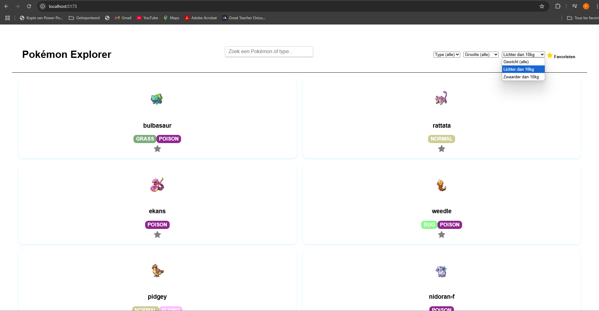

# Pokémon Explorer 

Een webhapplicatie waarmee je 30 Pokémons kunt ontdekken via de API PokéAPI. Deze applicatie maakt dus gebruik van de PokéAPI (https://pokeapi.co), een publieke API waarvoor geen sleutel nodig is. 
Het is een single page webapplicatie waarmee de Pokemons kunt verkennen, filteren, zoeken en opslaan in je favorietenlijst. De app werkt volledig zonder login of backend en bewaart data lokaal vie localStorage. 

## I. Projectbeschrijving en functionaliteiten 

1) Het haalt 30 Pokémons op via de API PokéAPI
2) Toont elk Pokémon als een visuele kaart met naam, afbeelding en types
3) Gebruikt async/await om data op te halen
4) DOM-manipulatie voor dynamisch aanmaken van kaarten
5) Detailweergave per Pokémon met type, gewicht, abilities en beschrijving.
6) Gekleurde type-badges (bv water --> blauw)
7) Mogelijkheid om Pokémon als favoriet te markeren met klikbare ster
8) Favorietenlijst zichtbaar via knop rechtsboven in de header
9) Favorieten worden opgeslagen in localStorage en blijven dus bewaard
10) Zoekbalk met suggesties met scrollToView (de pagina scrollt automatisch naar het detailgedeelte)
11) Filter op type, grootte en gewicht
12) Project is opgebouwd met Vite en heeft een correcte structuur (src/, index.html, …)

## II. Gebruikte API:

PokéAPI --> https://pokeapi.co/api/v2/pokemon?limit=30

## III. Technische vereisten + lijnnummers 

1. DOM manipulatie:  

    A. Elementen selecteren
        Ik selecteer elementen zoals pokemon-container, zoekinput, favorieten-popup via document.getElementById() of querySelector() om er later iets mee te doen. (lijn 11-12)

    B. Elementen manipuleren
        De kaarten van elke Pokémon worden dynamisch aangemaakt met innerHTML, en ook de favorietenlijst wordt volledig via JS opgebouwd telkens je ze opent (lijn 46, 139, 167 )

    C. Events aan elementen koppelen
        Ik heb addEventListener gebruikt voor volgende dingen: klik op de ster, zoekinput (input event), en filters (change events). (lijn 66, 101, 160, 208, 222)

2. Modern JavaScript:

    A. Gebruik van constanten
        Bijna alles staat in const tenzij het moet wijzigen, zoals const detailSection = ... (lijn 11-12)

    B. Template literals
        Ik gebruik backticks voor kaart HTML en de detailsectie:
        card.innerHTML = ` ... `; (lijn 46-55, 140-147)

    C. Iteratie over arrays
        Bijvoorbeeld forEach over de Pokémon-array en over de badges:
        pokemonArray.forEach(...) (lijn 20)
        pokeData.types.map(...) (lijn 50)

    D. Array methodes
        Ik gebruik .map(), .some(), .forEach(), .join() in verschillende plaatsen in mijn code
        (op veel plaatsen, dus ik geef enkele lijnen: 50, 33, 178, 50)
    E. Arrow functions
        Zoals bij zoeksuggesties.appendChild(...) of in map:
        types.map(t => t.type.name) (lijn 50, 20)

    F. Conditional (ternary) operator (moderne if..else)
        card.style.display = zichtbaar ? "block" : "none"; (lijn 269)

    G. Callback functions
        ik gebruik callbacks in .forEach, in .then(...), en in addEventListener (lijn 208)

    H. Promises
        Bij het ophalen van data via fetch(...).then(...). (lijn 20)

    I. Async & Await
        Voor de hoofddata:
        const getPokemonList = async () => {...}
        (lijn 15, 111)

    J. Observer API (1 is voldoende)
        Niet gebruikt in dit project

3. Data & API:

    A. Fetch om data op te halen
        Ik gebruik fetch om de Pokémonlijst en extra info op te halen van PokéAPI. (lijn 16, 21, 112, 115)

    B. JSON manipuleren en weergeven
        De data van de API wordt geparsed met .json() en gebruikt om kaarten, types, afbeeldingen enz. op te bouwen. (lijn 17, 21, 113, 116)

4. Opslag & validatie:

    A. Formulier validatie
        Niet van toepassing in dit project

    B. Gebruik van LocalStorage 
    Favorieten worden opgeslagen in localStorage en bij het herladen wordt dit terug getoond + de ster wordt weer goud. (lijn 30, 71, 94, 165)

5. Styling & layout:  

    A. Basis HTML layout (flexbox of CSS grid kan hiervoor worden gebruikt)
        Ik gebruik grid in #pokemon-container om alles netjes te tonen in 2 kolommen. (lijn css 8, 9)

    B. Basis CSS
        kleuren, rondingen, hover-effecten, badges per type...

    C. Gebruiksvriendelijke elementen (verwijderknoppen, icoontjes,...)
        Een klikbare ster om te favorieten, een dropdown voor filters, zoekbalk met suggesties...

6. Tooling & structuur: 

    A. Project is opgezet met Vite 
        Ik heb npm init vite gebruikt, met aparte mappen voor src, dist en gescheiden CSS/JS

    B. Een correcte folderstructuur wordt aangehouden (gescheiden html, css en js files, src folder, dist folder, ...)
        Mijn project zit in Vite-structuur met src/main.js, src/style.css en index.html in de root. Alles zit goed appart

## IV. Installatiehandleiding

1) Repository clonen 
    git clone https://github.com/frs-bgh/pokemon-explorer.git 

2) Navigeer naar de map 
    cd pokemon-explorer

3) Vite runnen 

    1. dependencies installeren 
        npm install 

    2. Start de dev server
        npm run dev 

4) Browser openen op http://localhost:5173 

## V. Screenshots van de applicatie 

* Homepage 

* Zoekbalk

* Favorietenlijst

* Filtermenu

* Filter op type 

* Filter op grootte

* Filter op gewicht

## VI. Gebruikte bronnen 

PokéAPI --> https://pokeapi.co/api/v2/pokemon?limit=30
ChatGPT (AI assistentie voor structuur en foutopsporing) --> https://chatgpt.com/share/682936bf-012c-8003-8cde-c3f4089e37df
MDN scrollIntoView --> https://developer.mozilla.org/en-US/docs/Web/API/Element/scrollIntoView
Prismic Blog: CSS Image Effects --> https://prismic.io/blog/css-image-effects
Add to favorites with JavaScript --> https://stackoverflow.com/questions/64830358/making-an-add-to-favorites-button-with-javascript 
JavaScript multiple rating SVG star click --> https://stackoverflow.com/questions/66139955/javascript-multiple-rating-svg-star-click 

### Auteur 
Het werd gemaakt door Fariss Boughaba voor het vak Web Advanced aan Erasmushogeschool Brussel